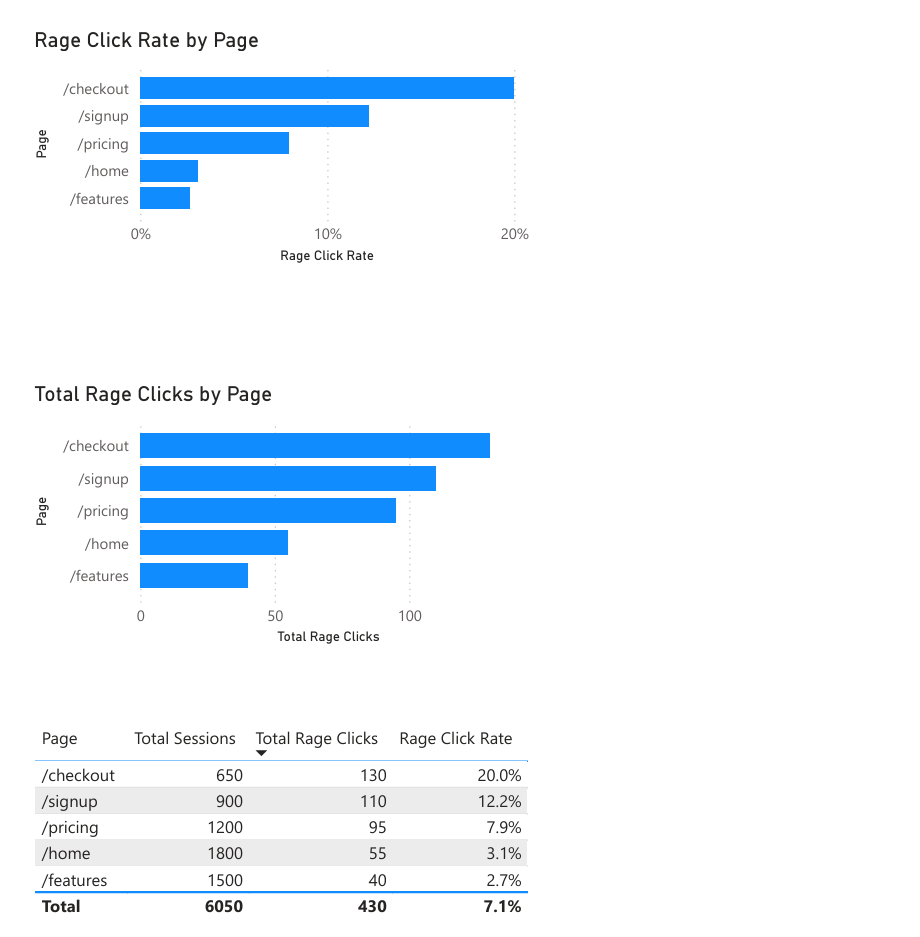

# UX Friction Analysis Using Microsoft Clarity & Power BI

## Overview
This project analyzes user frustration using Microsoft Clarity’s rage-click framework.
A reconstructed dataset was used to demonstrate how behavioral analytics can be modeled
and visualized in Power BI to prioritize UX improvements.

The goal is to distinguish between:
- **Severity** (rage-click rate)
- **Impact** (total rage clicks)

## Metrics
- **Rage Clicks**: Total rage-click events per page
- **Rage Click Rate**: rage clicks / sessions

## Tools
- Power BI
- Microsoft Clarity (behavioral analytics framework)
- Excel (data preparation)

## Key Insights (Summary)
- Checkout shows the highest rage-click rate, indicating severe UX friction.
- Signup and pricing pages contribute meaningful frustration due to traffic and unclear CTAs.
- Features page shows comparatively lower rage-click activity, suggesting stronger usability.

## Files in this Repo
- `dashboard.png` – Dashboard screenshot
- `data_clean/rage_clicks_by_page.csv` – Dataset
- `powerbi/clarity_rage_clicks.pbix` – Power BI file
- `insights.md` – Findings + recommendations

## Notes
The dataset was reconstructed from Microsoft Clarity demo behavior patterns for analytical demonstration purposes.
